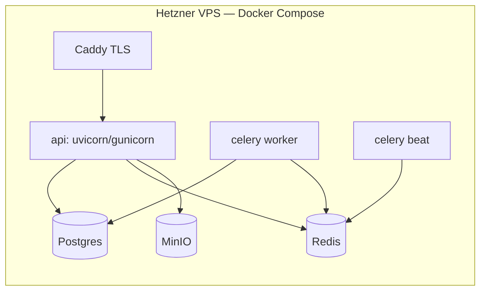
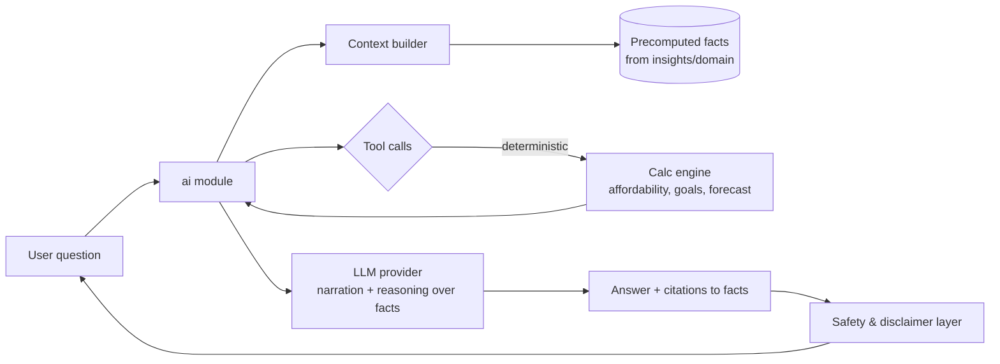
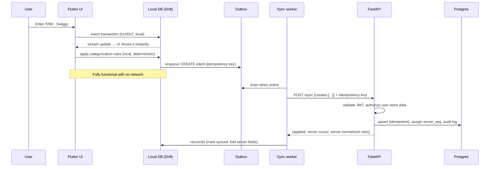
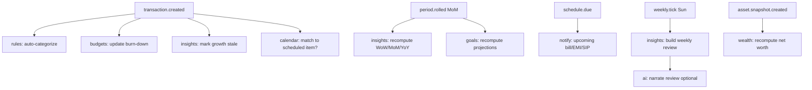

# FinOS — System Architecture

This document describes the system, service, backend, mobile, and AI architecture,
and records the major design decisions as ADRs. Deep dives live in
[`docs/DATABASE.md`](docs/DATABASE.md), [`docs/API.md`](docs/API.md), and
[`docs/AI.md`](docs/AI.md).

---

## Table of contents

1. [Design goals & constraints](#1-design-goals--constraints)
2. [High-level architecture](#2-high-level-architecture)
3. [Service architecture](#3-service-architecture)
4. [Backend architecture](#4-backend-architecture)
5. [Mobile architecture](#5-mobile-architecture)
6. [AI architecture (summary)](#6-ai-architecture-summary)
7. [Data flow](#7-data-flow)
8. [Event flow](#8-event-flow)
9. [Repository structure](#9-repository-structure)
10. [Architecture Decision Records](#10-architecture-decision-records)

---

## 1. Design goals & constraints

| Goal | Consequence for architecture |
|---|---|
| Offline-first | Mobile owns a full local database; server is the sync/authority peer, not the source of truth for reads. |
| Deterministic money | A single, pure **Financial Calculation Engine** (backend `domain/`, mirrored minimally on device) owns every number. |
| AI-optional | AI lives behind a feature flag and a provider abstraction; removing it breaks no core flow. |
| Modular | Feature modules on both client and server, each owning its data, logic, and API surface. |
| Small team / VPS | One deployable backend (modular monolith) + workers. No premature microservices. |
| India-first, global-later | Currency-aware from day 1 (store `currency` + minor units); no FX logic until needed. |

**Explicit non-goals for v1:** microservices, multi-region, real-time bank sync,
personalized investment advice, multi-currency conversion, web client.

---

## 2. High-level architecture

```mermaid
flowchart TB
    subgraph Device["📱 Flutter app (offline-first)"]
        UI[UI / Riverpod]
        LDB[(Local DB — Drift/SQLite)]
        ENG[Client calc engine\n(display-only projections)]
        OUT[Outbox / sync queue]
        UI --- LDB --- OUT
        LDB --- ENG
    end

    subgraph Edge["🌐 Edge"]
        CDN[TLS / reverse proxy\nCaddy or Nginx]
    end

    subgraph Backend["🖥️ FinOS backend (modular monolith)"]
        API[FastAPI\nREST + /sync]
        DOM[Financial Calculation Engine\n(pure, deterministic)]
        MOD[Feature modules\nexpenses · goals · budgets · calendar · wealth · ai]
        API --- MOD --- DOM
    end

    subgraph Workers["⚙️ Async workers"]
        CEL[Celery]
        BEAT[Celery Beat\nschedules]
    end

    subgraph Data["🗄️ Stateful services"]
        PG[(PostgreSQL\nsystem of record)]
        RDS[(Redis\nbroker + cache)]
        OBJ[(MinIO\nreceipts/files)]
    end

    subgraph External["External (managed)"]
        AUTH[Supabase Auth\nGoTrue + JWKS]
        LLM[LLM providers\nOpenAI / Anthropic]
    end

    Device <-->|HTTPS JWT| CDN <--> API
    Device -->|OAuth / OTP| AUTH
    API -->|verify JWT via JWKS| AUTH
    API --> PG
    API --> RDS
    API -->|presigned URLs| OBJ
    Device -->|direct upload presigned| OBJ
    API --> CEL
    CEL --> PG
    BEAT --> CEL
    MOD -->|only via ai module| LLM
```

**Reading the diagram:**

- The **phone is a full peer**: it has its own database and can create/read/edit
  without the server. The server is authority for cross-device merge, heavy compute,
  and anything the phone shouldn't be trusted to do alone.
- The **backend is a modular monolith**, not microservices. One process, clean module
  boundaries. This is the correct scale for a small team targeting tens of thousands
  of users. Split a module into its own service only when it has a *different scaling
  or deployment profile* (the AI module is the first candidate).
- **Supabase Auth is the only externalized part of the core.** We do not put financial
  data in Supabase; we use it purely as an identity provider and validate its JWTs.
- **The LLM is reachable only through the `ai` module.** No other module imports an
  LLM client. This is enforced structurally so deterministic paths can never
  accidentally depend on a model.

---

## 3. Service architecture

For v1 there is **one backend deployable** plus workers. Logical services are
*modules*, not processes:

| Module | Owns | Reads from |
|---|---|---|
| `identity` | User profile row, device registry, preferences | Supabase user id |
| `ledger` | Transactions, accounts, categories, merchants, rules | — |
| `budgets` | Budgets, budget periods, budget-vs-actual | ledger |
| `goals` | Goals, contributions, projections | ledger, wealth |
| `calendar` | Recurring items, scheduled instances, forecast | ledger |
| `subscriptions` | Subscriptions (a *view/specialization* of recurring items) | calendar, ledger |
| `wealth` | Assets, snapshots, net worth | — |
| `insights` | Growth comparisons, weekly review, precomputed facts | all above |
| `simulator` | Affordability & goal-impact scenarios | ledger, goals, wealth, calendar |
| `ai` | Assistant, insight narration, tool-calling into other modules | insights (+ read tools) |
| `files` | Presigned upload/download, attachment metadata | MinIO |
| `sync` | Delta pull/push, conflict resolution | all above |

**Deployment topology (v1):**



**Scale path (documented, not built yet):** managed Postgres (or read replicas) →
extract `ai` and `insights` into separate deployables → move object storage to S3/R2 →
container orchestration only if uptime SLAs require it. See
[ADR-001](#adr-001--modular-monolith-over-microservices).

---

## 4. Backend architecture

**Layering (per module):**

```
api/        HTTP concern only: routing, request/response schemas, auth deps.
service/    Use-case orchestration; transactions; calls domain + repositories.
domain/     PURE business logic. No I/O. The money engine lives here. Fully unit-tested.
repository/ Data access via SQLAlchemy. The only place that touches the DB.
models/     SQLAlchemy ORM models + Pydantic schemas.
```

Rules that keep the monolith from rotting:

- **`domain/` imports nothing with side effects.** No DB, no HTTP, no LLM, no clock —
  time and randomness are injected. This is what makes financial math testable and
  trustworthy.
- **Cross-module calls go through a module's `service` interface**, never by reaching
  into another module's repository or tables. This is the seam we'd cut along if we
  ever split services.
- **The `ai` module is the only importer of `llm/`.** Enforced by an import-lint rule
  in CI.

**The Financial Calculation Engine (`domain/`)** is the heart of the product. It is a
library of pure functions:

- growth deltas (WoW / MoM / YoY) with explicit period-alignment and
  partial-period handling,
- budget burn-down and projected end-of-period position,
- goal required-contribution and ETA under contribution scenarios,
- affordability: cashflow impact, savings-rate impact, goal delay, emergency-fund
  runway impact,
- net-worth rollups and asset-class allocation,
- cashflow forecast from scheduled/recurring items.

Every function is deterministic, currency-safe (integer minor units), and covered by
golden-file tests. **No LLM is ever in this path.**

**Tech choices:** FastAPI (async), SQLAlchemy 2.x async, Alembic migrations, Pydantic v2
for validation, `uv` for dependency management, `structlog` for structured logs,
Celery + Redis for jobs.

---

## 5. Mobile architecture

**Feature-first, offline-first.** State via Riverpod (v2 + codegen), navigation via
GoRouter, local persistence via Drift (SQLite). See
[ADR-002](#adr-002--local-database-drift-over-isar).

```
lib/
├── core/
│   ├── router/        # GoRouter config, guards, deep links
│   ├── db/            # Drift database, DAOs, migrations
│   ├── network/       # Dio client, auth interceptor, retry
│   ├── sync/          # outbox, delta pull/push, conflict handling
│   ├── auth/          # Supabase session, secure token storage
│   ├── money/         # Money value type, formatters (INR), calc helpers
│   └── di/            # Riverpod providers wiring
├── features/
│   └── <feature>/
│       ├── data/       # DAO + remote API + repository impl
│       ├── domain/     # entities, value objects, use cases
│       ├── application/# Riverpod notifiers / controllers (state)
│       └── presentation/ # screens + widgets
└── shared/            # design system, reusable widgets, error UI
```

**State management strategy**

- **Repository pattern**: UI reads from repositories, repositories read from the *local
  DB first* and reconcile with the server via sync. The UI never calls the network
  directly.
- **Riverpod `AsyncNotifier`** per feature controller; `freezed` immutable state; local
  DB streams (Drift `watch`) drive reactive rebuilds so any write updates the UI
  instantly, offline included.
- **Single source of truth on device = the local DB.** Network responses are folded into
  the DB, not shown directly.

**Offline sync strategy** (details in [docs/API.md](docs/API.md#sync-protocol)):

- **Client-generated UUIDv7 primary keys** so records can be created offline and never
  collide.
- **Outbox pattern**: every local mutation appends an intent to an `outbox` table.
  A background sync drains it with **idempotency keys** so replays are safe.
- **Delta sync**: `GET /sync?since=<cursor>` returns changed rows; client sends its
  outbox via `POST /sync`. Server returns a new cursor (a monotonic `server_seq`).
- **Conflict policy**: last-writer-wins per row using server-assigned `updated_at`, with
  **append-only entities (transactions, contributions, snapshots) preferring inserts
  over edits** to minimize real conflicts. Tombstones (`deleted_at`) propagate deletes.
  For the single-user, few-devices reality this is safe; the policy is centralized in
  one place so it can be upgraded to field-level merge later.

**Caching strategy**

- Local DB *is* the cache (durable). In-memory Riverpod caches are derived and
  disposable.
- Precomputed insight payloads (weekly review, growth cards) are cached with a
  `computed_at` and refreshed opportunistically after sync.

---

## 6. AI architecture (summary)

Full detail in [docs/AI.md](docs/AI.md). The one rule that shapes everything:

> **The LLM never computes a number the user relies on.** Deterministic code computes;
> the LLM narrates, explains, prioritizes, and converses over already-computed facts.



The LLM is given **structured, pre-computed facts** and a set of **tools that call the
deterministic engine**. It composes explanations and recommendations; it is prompted and
post-checked to never fabricate figures and to include the required non-advice
disclaimer (regulatory — see [SECURITY.md](SECURITY.md#privacy--regulatory)).

---

## 7. Data flow

**Adding an expense (offline-first happy path):**



**Reading the dashboard:** UI reads from local DB (instant). Growth/insight cards read
precomputed values synced from the server; if stale or absent, a lightweight on-device
calc renders a provisional value flagged "updating…" until sync completes.

---

## 8. Event flow

FinOS uses **internal domain events** (in-process, persisted to an `events` outbox on the
server) to keep modules decoupled and to trigger async work. This is not Kafka — it is a
transactional outbox table drained by Celery.



**Why an outbox, not direct calls:** writing the event in the *same DB transaction* as the
state change guarantees we never lose a trigger, and Celery retries give at-least-once
delivery. Handlers are idempotent. This keeps `transaction.created` from having to know
about budgets, insights, or the calendar.

**Scheduled events (Celery Beat):** materialize recurring items into concrete scheduled
instances (daily), fire upcoming-bill notifications, recompute period rollups at month
boundaries, and build the weekly review every Sunday.

---

## 9. Repository structure

```
finos/
├── README.md
├── ARCHITECTURE.md
├── SECURITY.md
├── CONTRIBUTING.md
├── MILESTONES.md
│
├── docs/                          # Design docs & decision records
│   ├── DATABASE.md                #   entities, ERD, indexing, audit
│   ├── API.md                     #   REST + sync protocol
│   ├── AI.md                      #   deterministic/LLM split, prompts, cost
│   └── adr/                       #   one file per accepted decision
│
├── backend/                       # FastAPI modular monolith
│   ├── app/
│   │   ├── main.py                #   app factory, middleware, router mount
│   │   ├── core/                  #   config, security, logging, errors, clock
│   │   ├── db/                    #   session, base model, mixins (soft-delete/audit)
│   │   ├── domain/                #   PURE money engine (no I/O) — the crown jewels
│   │   ├── llm/                   #   provider-abstracted LLM client (only ai/ imports)
│   │   ├── modules/               #   feature modules (see §3): each has
│   │   │   └── <module>/          #     api/ service/ repository/ models/ events/
│   │   ├── workers/               #   Celery app, tasks, beat schedule
│   │   └── api/                   #   version mount (/v1), shared deps, error handlers
│   ├── migrations/                #   Alembic
│   ├── tests/                     #   unit (domain), integration (api+db), contract
│   └── pyproject.toml
│
├── frontend/                      # Flutter app
│   ├── lib/                       #   core/ features/ shared/ (see §5)
│   ├── test/                      #   unit + widget + golden tests
│   ├── integration_test/          #   end-to-end flows
│   └── pubspec.yaml
│
├── infra/                         # Everything to run it
│   ├── docker/                    #   Dockerfiles (api, worker)
│   ├── compose/                   #   dev.yml, prod.yml
│   ├── ci/                        #   pipeline definitions
│   ├── provisioning/              #   VPS bootstrap, backups, TLS
│   └── observability/             #   logging/metrics/uptime config
│
└── .github/                       # CI workflows, PR/issue templates, CODEOWNERS
```

**Directory rationale**

| Directory | Why it exists |
|---|---|
| `backend/app/domain/` | Isolating pure financial logic from I/O is the single most important structural decision. It is unit-tested to death and never touches a network or a model. |
| `backend/app/llm/` | A hard wall around AI. Only `modules/ai` may import it, enforced in CI. Guarantees AI-optionality. |
| `backend/app/modules/<m>/` | Module = the unit of ownership and the future service-split boundary. Consistent internal layering makes every module navigable the same way. |
| `backend/app/workers/` | Async work (recurring materialization, notifications, insight precompute, weekly review) is separated from request handling. |
| `frontend/lib/core/sync/` | Offline-first's hardest logic (outbox, delta, conflicts) lives in exactly one place, not scattered across features. |
| `frontend/lib/features/<f>/` | Feature-first keeps a feature's UI, state, and data together so it can be built, tested, and reasoned about in isolation. |
| `infra/` | Reproducible environments and one-command bring-up; disaster recovery lives here (backups, restore runbooks). |
| `docs/adr/` | Decisions are captured where they can be found and revisited, with context and consequences. |

---

## 10. Architecture Decision Records

Short ADRs for the load-bearing choices. New significant decisions get a file in
`docs/adr/`.

### ADR-001 — Modular monolith over microservices

**Context:** Small team, VPS hosting, target of tens of thousands of users.
**Decision:** One backend deployable with strict internal module boundaries; workers
separate. **Consequences:** Simple ops, easy transactions, fast iteration. Enforce module
boundaries in code so a future split is mechanical. Split only a module with a genuinely
different scaling profile (AI first). **Rejected:** microservices — operational and
distributed-transaction cost is unjustified at this scale.

### ADR-002 — Local database: Drift over Isar

**Context:** Offline-first needs a robust device database with relational queries,
transactions, and reliable migrations, for money data we cannot corrupt.
**Decision:** Use **Drift (SQLite)** rather than the stack's proposed Isar.
**Rationale:** SQLite is the most battle-tested embedded DB on earth; Drift gives typed
queries, transactions, migrations, and reactive `watch` streams. Isar's long-term
maintenance has been uncertain, and financial data warrants the conservative choice; its
relational shape also mirrors the Postgres model, simplifying sync. **Consequences:**
Slightly more boilerplate than Isar's object store; worth it. **Revisit if:** Isar
stabilizes and a measured performance need appears. *(This is a recommended change to the
stated stack — see the product analysis.)*

### ADR-003 — Auth: Supabase Auth (managed), data in our Postgres

**Context:** We want strong, low-effort auth but must keep financial data under our
control on the VPS. **Decision:** Use **Supabase Auth (GoTrue) as an external identity
provider only**. The API validates JWTs against Supabase JWKS. On first authenticated
request we **JIT-provision** a local `users` profile row keyed by the Supabase user UUID.
No cross-database foreign key. **Consequences:** Offloads password/OTP/OAuth/session
security; our sensitive tables never live in Supabase. Must handle key rotation and a
webhook (or JIT) for user lifecycle. **Rejected:** rolling our own auth (risky), or
putting all data in Supabase (loses data sovereignty). See
[SECURITY.md](SECURITY.md#authentication).

### ADR-004 — Money as integer minor units

**Decision:** All monetary amounts stored as `BIGINT` **minor units** (paise) plus a
`currency CHAR(3)`. Never floats. Asset *quantities* (units/grams/coins) use
`NUMERIC(28,8)`. **Consequences:** No rounding drift; explicit currency; trivial global
support later. A `Money` value type wraps (`amount_minor`, `currency`) on both client and
server. See [docs/DATABASE.md](docs/DATABASE.md#money--currency).

### ADR-005 — Deterministic engine vs LLM

**Decision:** A pure `domain/` engine computes every figure; the `ai` module may only read
precomputed facts and call deterministic tools. Import-lint forbids `llm/` usage outside
`modules/ai`. **Consequences:** AI is optional and can never corrupt financial output.
See [docs/AI.md](docs/AI.md).

### ADR-006 — Sync: client UUIDs, outbox, delta, LWW

**Decision:** UUIDv7 client keys, transactional outbox on device, `/sync` delta protocol
with a monotonic server cursor, idempotency keys, last-writer-wins with append-only
preference and tombstones. **Consequences:** Robust offline UX; conflicts are rare and
resolution is centralized and upgradeable. See
[docs/API.md](docs/API.md#sync-protocol).

### ADR-007 — Subscriptions are a specialization of recurring calendar items

**Decision:** Do **not** build a separate subscriptions subsystem. A subscription is a
recurring item (in `calendar`) tagged `is_subscription` with vendor/plan/renewal
metadata. **Consequences:** One recurrence engine, one forecast, one source of truth;
the "Subscription Manager" is a filtered view + analytics over recurring items. Avoids
duplicated recurrence logic. See [docs/DATABASE.md](docs/DATABASE.md).

### ADR-008 — Immutable, double-entry-friendly ledger

**Context:** Balances must be exact and auditable; financial history must not be
rewritten. **Decision:** A transaction projects to immutable **ledger entry** postings;
an account balance is *defined* as the sum of its entries. Edits and deletes append
*reversing* entries rather than mutating history. **Consequences:** Balances are always
exact, the full history of every change is preserved, and reconciliation is possible.
Transfers satisfy the strict double-entry (nets-to-zero) invariant; income/expense are
single-sided. See [docs/TRANSACTION_ENGINE.md](docs/TRANSACTION_ENGINE.md).

### ADR-009 — Portable ORM models (Postgres in prod, SQLite in tests)

**Context:** We need fast, hermetic tests of the full persistence + sync stack without
standing up Postgres, while deploying on Postgres. **Decision:** Use only portable
SQLAlchemy types (`Uuid`, `BigInteger`, `JSON`, non-native `Enum`), Python-side timestamp
defaults, and an app-assigned `server_seq` (no DB sequence). **Consequences:** Integration
tests run on in-memory SQLite (aiosqlite) with zero services; the same code runs on
Postgres 16. Trade-off: we forgo a few Postgres-specific niceties (JSONB indexing, native
enums) at this layer — acceptable, and reversible per-column later.

---

## 11. Platform foundation (implemented)

The transaction/sync foundation that every future module builds on is implemented and
under test (unit + integration, ruff + mypy-strict + architecture tests). Deep dives:

- **[docs/TRANSACTION_ENGINE.md](docs/TRANSACTION_ENGINE.md)** — entities, the immutable
  double-entry posting model, balances, reconciliation, categorization, lifecycle.
- **[docs/SYNC_ARCHITECTURE.md](docs/SYNC_ARCHITECTURE.md)** — sync-ready entities, the
  `server_seq` cursor, pull/push, conflict detection, incremental + full-sync recovery.
- **[docs/EVENT_ARCHITECTURE.md](docs/EVENT_ARCHITECTURE.md)** — domain events, the
  in-process bus, and the transactional outbox other modules subscribe to.
- **[docs/REPORTING_ENGINE.md](docs/REPORTING_ENGINE.md)** — deterministic spending,
  growth, and period analytics (the inputs future AI features consume).
- **[docs/SECURITY_REVIEW.md](docs/SECURITY_REVIEW.md)** — security, scalability,
  consistency, and offline-sync risk review with fixes applied.

Modules implemented: `accounts`, `categories`, `merchants`, `ledger` (transactions +
immutable entries), `rules` (engine + simulation + testing), `reporting`, `sync`, `audit`,
plus the `events` (bus + outbox) infrastructure. The AI wall and domain purity are
enforced by `backend/tests/test_architecture.py`.

### ADR-010 — One shared recurrence engine

**Context:** Recurring expenses, subscriptions, salary, and the calendar all need "when
does this repeat?". **Decision:** A single pure, interval-based recurrence engine
(`domain/recurrence.py`) with month-end clamping powers all of them; a subscription is a
`RecurringSeries` with `is_subscription=true` (ADR-007). **Consequences:** No duplicated
schedule logic; one place to test. **Rejected:** per-feature schedulers. Full iCal RRULE is
a documented extension that keeps the same interface. See
[docs/RECURRING_ENGINE.md](docs/RECURRING_ENGINE.md).

### ADR-011 — Planning read-models are computed on read, not stored

**Context:** Goal projections, budget utilization/periods, the calendar, forecasts, and
subscription analytics all derive from the ledger + a few definitions. **Decision:**
**Compute them on read** from the source of truth; persist only genuine state (goals &
contributions, budgets & allocations, recurring series, and event-generated
`budget_alerts`). **Consequences:** These read-models can never drift from actual
transactions — the strongest form of "updates automatically" (requirement 8) — and need no
event handlers. Events are used only for side effects that must be captured at their moment
(budget alerts), delivered via the transactional outbox + dispatcher. **Tradeoff:**
aggregate queries on read; mitigated by composite indexes and bounded windows, with
precomputation available later if profiling requires it.

---

## 12. Financial planning layer (implemented)

Built entirely on the transaction foundation (no foundation changes). Deterministic, AI-free,
tested (ruff + mypy-strict + unit + integration + architecture tests). Deep dives:

- **[docs/GOALS_ENGINE.md](docs/GOALS_ENGINE.md)** — goals, contributions, milestones, projections.
- **[docs/BUDGET_ENGINE.md](docs/BUDGET_ENGINE.md)** — budgets, allocations, utilization, alerts.
- **[docs/RECURRING_ENGINE.md](docs/RECURRING_ENGINE.md)** — recurrence, detection, subscriptions.
- **[docs/FINANCIAL_CALENDAR.md](docs/FINANCIAL_CALENDAR.md)** — computed financial-event stream.
- **[docs/FORECASTING_ENGINE.md](docs/FORECASTING_ENGINE.md)** — deterministic cash forecasting.
- **[docs/SIMULATION_ENGINE.md](docs/SIMULATION_ENGINE.md)** — purchase/EMI/goal-impact decisions.

**Pure engines** (`domain/`): `goals`, `budgets`, `recurrence`, `detection`, `subscriptions`,
`forecasting`, `simulation`. **Modules** (`modules/`): `goals`, `budgets`, `recurring`,
`subscriptions`, `calendar`, `forecasting`, `simulation`.

**Event integration:** the ledger's existing `TransactionCreated` events are drained from the
transactional outbox by `app/events/dispatcher.py` to idempotent handlers
(`app/events/handlers.py`) — currently budget-threshold alerts. Goals, budgets, calendar, and
forecasts stay current by being computed on read (ADR-011), so they require no coupling to the
ledger at all.

**Shared abstractions (anti-silo):** one recurrence engine (ADR-010), the `Money` type and
reporting engine reused across every module, goal projection reused by the simulator, and a
single "compute-on-read" pattern (ADR-011) applied uniformly.

### ADR-012 — Production auth: Supabase JWKS verification

**Context:** the dev bypass must be replaced with real verification. **Decision:** the API
verifies the access JWT's signature against Supabase's **JWKS** (RS256/ES256), checks
`exp`/`aud`/`sub`, and extracts `sub` as the user id; JWKS fetch runs in a worker thread
(pyjwt caches keys, refetches on rotation). Sign-up/in/out and session restoration are
handled by the Supabase SDK on the client; the backend only validates. Dev bypass remains for
local/test and is ignored in prod. **Consequences:** no shared secret in the API, rotation-safe,
stateless. See [SECURITY.md](SECURITY.md#authentication).

### ADR-013 — Dashboard is a backend-for-frontend aggregate

**Decision:** a single `GET /v1/dashboard` composes every home-screen section server-side
(one call per engine, ids-not-names) instead of the app making 6+ calls. **Consequences:** one
round-trip and a consistent snapshot on the hottest screen; no new financial math; cache-able
by sync cursor. See [docs/DASHBOARD_ARCHITECTURE.md](docs/DASHBOARD_ARCHITECTURE.md).

---

## 13. Product experience layer (implemented)

Built on the foundation + planning layers without changing them. Deterministic and AI-free;
green on ruff, mypy-strict, architecture tests, and unit + integration tests.

- **Production auth** — Supabase JWKS verification ([SECURITY.md](SECURITY.md), ADR-012).
- **User profile & preferences** — `identity` module (currency/locale/timezone/week-start/
  income + `financial_priority`/`risk_profile`); consumed by the copilot.
- **Sync completion** — goals, budgets, recurring (subscriptions), and profiles now participate
  in delta sync alongside the core entities ([SYNC_ARCHITECTURE.md](docs/SYNC_ARCHITECTURE.md)).
- **Insight engine** — deterministic, explainable insights ([INSIGHT_ENGINE.md](docs/INSIGHT_ENGINE.md)).
- **Review engine** — stored weekly/monthly/quarterly snapshots ([REVIEW_ENGINE.md](docs/REVIEW_ENGINE.md)).
- **Notification engine** — rules/preferences/queue, vendor-neutral ([NOTIFICATION_ENGINE.md](docs/NOTIFICATION_ENGINE.md)).
- **Dashboard BFF** — one optimized read ([DASHBOARD_ARCHITECTURE.md](docs/DASHBOARD_ARCHITECTURE.md)).
- **AI copilot foundation** — `modules/ai` context/prompt builders ([AI_COPILOT_ARCHITECTURE.md](docs/AI_COPILOT_ARCHITECTURE.md)).
- **Flutter app** — feature-first, offline-first architecture ([FRONTEND_ARCHITECTURE.md](docs/FRONTEND_ARCHITECTURE.md)).

New modules: `identity`, `insights`, `reviews`, `notifications`, `dashboard`, `ai`. New pure
domain: `insights`, `reviews`. The deterministic wall and domain purity remain enforced.
