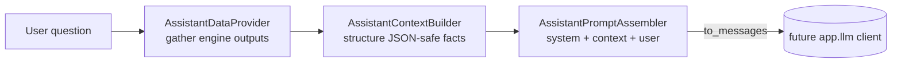

# FinOS — AI Copilot Architecture (Foundation)

The final assistant is **out of scope** here; this documents the *foundation* it will call.
The one invariant that shapes everything (ADR-005): **the AI never computes a financial
value — it only explains pre-computed, deterministic outputs.**

Code: [`app/modules/ai/`](../backend/app/modules/ai) (the only module permitted to import
`app.llm`, enforced by `tests/test_architecture.py`).

---

## The three pieces

1. **`AssistantDataProvider`** — gathers *already-computed* outputs: insights, 30-day forecast,
   goal projections, budget statuses, subscription cost, recent reviews, and the user's
   `financial_priority` / `risk_profile`. Reads only; performs **no arithmetic**.
2. **`AssistantContextBuilder`** — flattens that into a compact, JSON-safe fact set: labelled,
   pre-computed numbers the model may quote but can never invent.
3. **`AssistantPromptAssembler`** — produces a `system` / `context` / `user` triple. The system
   layer encodes the hard rules ("NEVER perform arithmetic; every number must appear in the
   context; this is information, not regulated advice"). `to_messages()` yields a
   provider-neutral message list a future `app.llm` client consumes.

`POST /v1/ai/context` returns the assembled prompt so the foundation is **verifiable
end-to-end without a model** (tested in `test_integration_px.py`).

## What the assistant will consume

Insights · Reviews · Forecasts · Goals · Budgets · Simulations — all deterministic engine
outputs. When the assistant lands it will: build context → hand the messages to `app.llm` →
post-check that every number in the answer appears in the context → append the non-advice
disclaimer. It may also expose the deterministic engines (e.g. `simulate_purchase`) as
**tools** so it fetches exact figures rather than guessing.

## Guarantees

- **Deterministic wall (ADR-005):** import-lint keeps `llm/` reachable only from `modules/ai`;
  the domain/planning engines can never depend on a model.
- **No fabricated numbers:** the context is the sole source of facts; the system prompt and a
  future post-processor enforce it.
- **AI-optional:** removing the copilot changes no core behavior — the insights/reviews/
  forecasts it narrates are all independently available.

## Future extension points

- Concrete `app.llm` provider clients (Anthropic/OpenAI) behind the abstraction, with routing,
  budgets, caching, and fallback (see [AI.md](AI.md)).
- Tool-calling into the deterministic engines.
- Per-user AI budget + safety post-processing.
