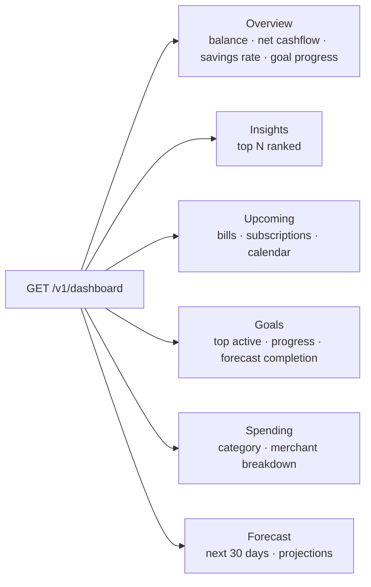

# FinOS — Dashboard Architecture

The dashboard is the heart of the app. `GET /v1/dashboard` is a **backend-for-frontend
(BFF) façade** that returns every home-screen section in one call — no N+1, no chatty
round-trips.

Code: [`app/modules/dashboard/`](../backend/app/modules/dashboard).

---

## Sections (one payload)

| Section | Source |
|---|---|
| Overview | account balances + this-month reporting + `savings_rate` |
| Insights | `insights.service.generate` (top N) |
| Upcoming | `calendar.service.build_events` (next 14 days) |
| Goals | active goals + `goals.get_projection` |
| Spending | `spending_by_category` / `spending_by_merchant` (this month, top N) |
| Forecast | `forecasting.build_forecast` (30d) |

## Avoiding N+1

- **One call per engine**, never per item: the service computes the month's reporting records
  **once** and reuses them for overview + spending slices; each other section is a single
  engine call. Cost is `O(engines)`, not `O(transactions)`.
- **Ids, not names:** spending slices return `category_id` / `merchant_id`, not names. The
  offline-first client already holds the category/merchant catalog locally (synced) and maps
  names itself — eliminating N join/lookups on the hot path.
- **Bounded fan-out:** top-N caps everywhere; the forecast timeline is pre-sampled.

## Why a BFF endpoint (ADR-013)

**Decision:** a dedicated aggregate endpoint that returns the response schema directly, rather
than the app composing 6+ calls. **Consequences:** one network round-trip on the most-loaded
screen, a single consistent snapshot (`generated_at`), and mobile-friendly payloads. It is
read-only and composes existing services — it introduces **no new financial math** and
respects every engine boundary. **Tradeoff:** the endpoint fans out server-side; acceptable
and cache-able, and far cheaper than N mobile round-trips over mobile networks.

## Offline behavior

The client renders the dashboard from its **local cache** instantly, then refreshes from this
endpoint after sync — the payload maps cleanly onto locally-held entities (see
[FRONTEND_ARCHITECTURE.md](FRONTEND_ARCHITECTURE.md)).

## Future extension points

- Per-user server-side caching keyed on the sync cursor (invalidate on new `server_seq`).
- Section selection (`?include=overview,goals`) for partial refreshes.
- Precomputed dashboard snapshot on the period tick.
