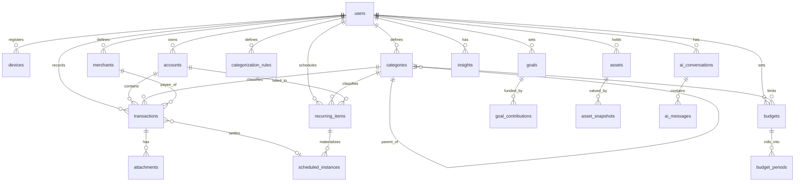

# FinOS — Database Design

PostgreSQL 16 is the system of record. This document covers core entities, the ERD,
table structure, indexing, soft-delete, and audit strategy. Design rules:

- **Money = integer minor units** (`amount_minor BIGINT`) + `currency CHAR(3)`. Never floats.
- **Asset quantities** = `NUMERIC(28,8)` (units, grams, coins can be fractional).
- **Primary keys = UUIDv7** (`id UUID`), client-generatable, time-sortable, non-enumerable.
- **Every user-owned row has `user_id`** and is always queried scoped to the authenticated user.
- **Sync columns on every syncable table:** `server_seq BIGINT` (monotonic), `updated_at`,
  `deleted_at` (soft delete / tombstone), `version INT`.
- **Timestamps** are `TIMESTAMPTZ`, stored UTC.

---

## Money & currency

A reusable pattern, not a table: every monetary column pairs an integer minor-unit amount
with a currency. For v1 everything is `INR`, but the column exists so global support is a
data change, not a schema migration. A `Money(amount_minor, currency)` value object wraps it
in code. Aggregations only sum amounts of the same currency.

---

## Core entities

| Entity | Purpose |
|---|---|
| `users` | Local profile keyed to the Supabase auth UUID; preferences, base currency. |
| `devices` | Registered devices for sync + session management. |
| `accounts` | Money containers: cash, bank, wallet, credit card (manual in v1). |
| `categories` | Hierarchical spend/income categories (system + user). |
| `merchants` | Normalized payees/merchants (Swiggy, "Mom", Netflix). |
| `transactions` | The ledger. Expense/income/transfer. Append-only bias. |
| `categorization_rules` | User rules that auto-assign category/merchant. |
| `budgets` / `budget_periods` | Per-category (or overall) limits per period + rollup. |
| `goals` / `goal_contributions` | Savings goals and their funding events. |
| `recurring_items` | Rent, EMI, SIP, bills, **subscriptions** (a specialization). |
| `scheduled_instances` | Concrete future occurrences materialized from recurring items. |
| `assets` / `asset_snapshots` | Wealth holdings and point-in-time valuations. |
| `insights` | Precomputed facts (growth deltas, weekly review, forecasts). |
| `attachments` | Receipt/file metadata (bytes live in MinIO). |
| `ai_conversations` / `ai_messages` | Assistant threads (opt-in). |
| `audit_log` | Append-only security/audit trail. |
| `sync_state` | Per-device sync cursors. |

---

## ERD



---

## Table structure (key tables)

Common columns (the **`SyncMixin`** + **`AuditMixin`**), present on all user-owned tables:

```
id            UUID  PK            -- UUIDv7, client-generatable
user_id       UUID  NOT NULL      -- tenant scope (indexed everywhere)
created_at    TIMESTAMPTZ NOT NULL DEFAULT now()
updated_at    TIMESTAMPTZ NOT NULL DEFAULT now()
deleted_at    TIMESTAMPTZ NULL     -- soft delete / tombstone
version       INT   NOT NULL DEFAULT 1
server_seq    BIGINT NOT NULL      -- assigned server-side, monotonic per user (sync cursor)
```

### transactions (the ledger)

```
id, user_id, ...sync/audit...
account_id    UUID NOT NULL FK accounts
type          TEXT NOT NULL  -- 'expense' | 'income' | 'transfer'
amount_minor  BIGINT NOT NULL
currency      CHAR(3) NOT NULL
occurred_at   TIMESTAMPTZ NOT NULL          -- when it happened (user-facing time axis)
category_id   UUID NULL FK categories
merchant_id   UUID NULL FK merchants
counter_account_id UUID NULL FK accounts    -- for transfers
note          TEXT NULL                      -- app-level encryption candidate
source        TEXT NOT NULL DEFAULT 'manual' -- manual|recurring|import|sms|aa
rule_id       UUID NULL FK categorization_rules -- which rule categorized it
external_ref  TEXT NULL                      -- idempotency for imports/AA (unique per user+source)
```

Notes: transfers are represented either as a single row with `counter_account_id` or as a
paired debit/credit — we choose **single-row transfers** for simplicity, excluded from
income/expense aggregates. `external_ref` gives idempotent ingestion.

### categorization_rules

```
id, user_id, ...sync...
priority      INT NOT NULL       -- lower = evaluated first
is_active     BOOL NOT NULL DEFAULT true
conditions    JSONB NOT NULL     -- e.g. {"all":[{"field":"merchant","op":"eq","value":"Swiggy"}]}
actions       JSONB NOT NULL     -- e.g. {"category_id":"...","merchant_id":"..."}
```

Rules are a small, versioned condition/action DSL (not free code). Evaluated
deterministically on device (for instant categorization) and on server (authoritative).
Time-window conditions supported (e.g. "between 22:00–04:00 → Late-night food").

### recurring_items (incl. subscriptions)

```
id, user_id, ...sync...
name          TEXT NOT NULL        -- 'Rent', 'Netflix', 'SIP - Index Fund'
kind          TEXT NOT NULL        -- rent|emi|sip|utility|subscription|credit_card_bill|other
is_subscription BOOL NOT NULL DEFAULT false
amount_minor  BIGINT NULL          -- NULL if variable (materialize with estimate)
currency      CHAR(3) NOT NULL
account_id    UUID NULL FK accounts
category_id   UUID NULL FK categories
rrule         TEXT NOT NULL        -- iCal RRULE (e.g. FREQ=MONTHLY;BYMONTHDAY=1)
next_due_at   TIMESTAMPTZ NOT NULL
end_at        TIMESTAMPTZ NULL
vendor        TEXT NULL            -- subscription vendor/plan metadata
billing_cycle TEXT NULL            -- monthly|annual for cost analysis
auto_renew    BOOL NULL
```

One recurrence engine (`rrule`) powers rent, EMI, SIP, bills, **and** subscriptions.
The "Subscription Manager" is `WHERE is_subscription` + cost rollups (see
[ADR-007](../ARCHITECTURE.md#adr-007--subscriptions-are-a-specialization-of-recurring-calendar-items)).

### scheduled_instances (materialized occurrences → cashflow forecast)

```
id, user_id, recurring_item_id FK, ...sync...
due_at        TIMESTAMPTZ NOT NULL
amount_minor  BIGINT NOT NULL      -- estimated or fixed
currency      CHAR(3) NOT NULL
status        TEXT NOT NULL        -- upcoming|paid|skipped|overdue
transaction_id UUID NULL FK transactions  -- link when settled
```

Celery Beat materializes a rolling horizon (e.g. next 90 days). The calendar and cashflow
forecast read from here — deterministic, no guessing at query time.

### goals & goal_contributions

```
goals: id, user_id, name, target_amount_minor, currency, deadline DATE NULL,
       priority INT, status (active|paused|achieved|archived), auto_contribution_minor NULL
goal_contributions: id, user_id, goal_id FK, amount_minor, currency, occurred_at,
       transaction_id UUID NULL FK  -- optional link to the actual transfer
```

Progress, required monthly contribution, and ETA are **computed** by the domain engine,
not stored as truth (stored only as cached `insights`).

### assets & asset_snapshots (wealth)

```
assets: id, user_id, name, asset_class (bank|cash|stock|mf|gold|crypto|fd|other),
        quantity NUMERIC(28,8) NULL, currency, metadata JSONB
asset_snapshots: id, user_id, asset_id FK, as_of DATE, value_minor BIGINT, currency,
        quantity NUMERIC(28,8) NULL
```

Net worth = latest snapshot per asset, summed by currency. History enables the wealth trend.

### budgets & budget_periods

```
budgets: id, user_id, category_id NULL(overall), amount_minor, currency, period (monthly|weekly),
         rollover BOOL
budget_periods: id, user_id, budget_id FK, period_start DATE, period_end DATE,
         limit_minor BIGINT, spent_minor BIGINT (cached), currency
```

`spent_minor` is a cached rollup refreshed on `transaction.created`; the authoritative
figure is always recomputable from the ledger.

### audit_log (append-only)

```
id            UUID PK
actor_type    TEXT   -- user|system|worker
actor_id      UUID NULL
action        TEXT   -- create|update|delete|login|export|ai_query|...
entity_type   TEXT NULL
entity_id     UUID NULL
diff          JSONB NULL   -- before/after for sensitive entities (masked)
correlation_id TEXT NULL
ip            INET NULL
created_at    TIMESTAMPTZ NOT NULL DEFAULT now()
```

Insert-only; no `UPDATE`/`DELETE` grants for the app role. Retained separately from
operational data.

---

## Indexing strategy

| Table | Indexes | Why |
|---|---|---|
| all user tables | `(user_id, server_seq)` | The sync delta query + tenant scope in one index. |
| all user tables | partial `WHERE deleted_at IS NULL` on hot lookups | Skip tombstones on normal reads. |
| transactions | `(user_id, occurred_at DESC)` | Ledger listing & date-range dashboards. |
| transactions | `(user_id, category_id, occurred_at)` | Category growth (WoW/MoM/YoY) and budgets. |
| transactions | `(user_id, merchant_id, occurred_at)` | Merchant growth (e.g. Swiggy +34%). |
| transactions | unique `(user_id, source, external_ref)` | Idempotent import/AA/SMS ingestion. |
| scheduled_instances | `(user_id, due_at)` partial `status='upcoming'` | Calendar & upcoming-bill notifications. |
| recurring_items | `(user_id, next_due_at)` | Beat materialization scan. |
| asset_snapshots | `(user_id, asset_id, as_of DESC)` | Latest valuation per asset. |
| goal_contributions | `(user_id, goal_id, occurred_at)` | Goal progress. |
| audit_log | `(user_id, created_at)`, `(entity_type, entity_id)` | Investigations. |

Growth comparisons use `occurred_at` range scans + aggregation; heavy rollups are
precomputed by workers into `insights` rather than computed per request. Consider monthly
**partitioning of `transactions`** only when volume warrants it (documented, not premature).

---

## Soft-delete strategy

- User-facing deletes set `deleted_at` (never hard-delete ledger/goal/asset history).
- Every default query excludes `deleted_at IS NOT NULL`; a shared repository base applies
  this automatically so a developer cannot forget.
- Tombstones sync to devices so deletes propagate offline.
- **Hard delete** happens only for (a) account deletion (DPDP right to erasure) via a
  dedicated, audited, re-auth-gated flow, and (b) background purge of tombstones older than
  a retention window *after* all devices have synced past them.

---

## Audit strategy

- Writes to sensitive entities emit an audit row **in the same transaction** (via the
  server-side outbox), so state change and audit never diverge.
- Diffs are stored for money-bearing and security-relevant changes, with amounts kept but
  secrets/PII masked.
- Security events (login, export, delete-account, authЗ failure, AI budget exhaustion) are
  first-class audit entries and feed alerting (see [SECURITY.md](../SECURITY.md#11-audit-logging)).

---

## Sync state

```
sync_state: id, user_id, device_id FK, last_pulled_seq BIGINT, last_pushed_at TIMESTAMPTZ
```

Drives the delta protocol in [API.md](API.md#sync-protocol): the client asks for everything
with `server_seq > last_pulled_seq`. `server_seq` is assigned from a per-user monotonic
sequence on every write so ordering is total and gap-tolerant.
