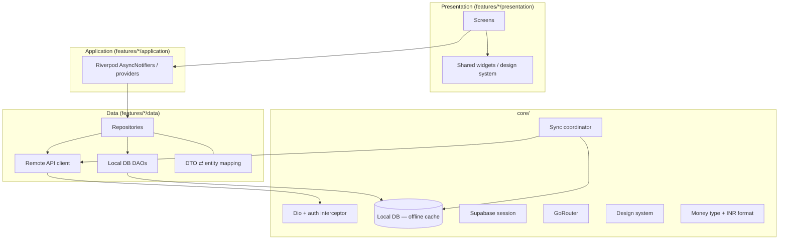
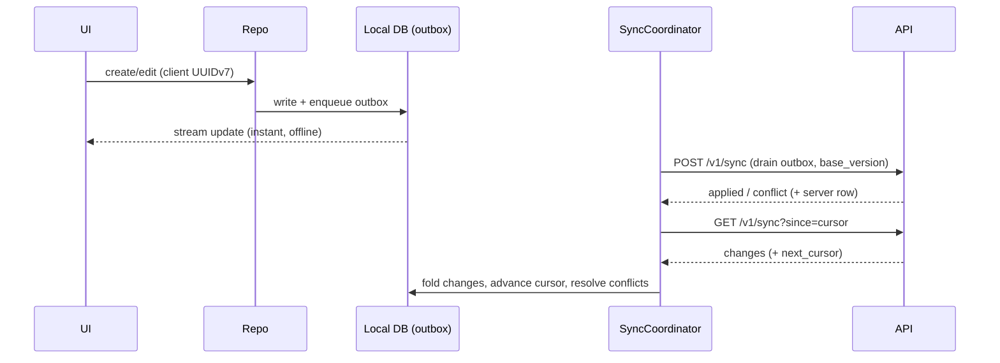

# FinOS — Frontend Architecture (Flutter)

Production-ready, feature-first, offline-first Flutter architecture. Riverpod for state,
GoRouter for navigation, a local database for the offline cache, and a sync coordinator that
reconciles with the backend's delta-sync protocol.

> **Toolchain note:** this repo's `frontend/` contains the app source. It requires a Flutter
> SDK to `flutter pub get` / `flutter analyze` / run (not available in the CI sandbox that
> builds the backend). The structure and patterns below are what the code implements.

---

## Layered architecture



**Rule:** the UI reads from **repositories**, repositories read the **local DB first** and
reconcile via the sync coordinator. Widgets never call the network directly.

## Folder structure (feature-first)

```
lib/
├── core/
│   ├── theme/           # design system: AppColors, AppTheme, spacing, typography
│   ├── router/          # GoRouter config + guards (auth redirect)
│   ├── network/         # Dio client, auth interceptor, error mapping
│   ├── db/              # local database + DAOs (offline cache)
│   ├── sync/            # SyncCoordinator (pull/push against /v1/sync)
│   ├── auth/            # Supabase session, secure token storage
│   ├── money/           # Money value type + INR formatter
│   └── di/              # Riverpod providers wiring
├── features/
│   └── <feature>/
│       ├── data/          # dto.dart, repository.dart, api.dart, dao.dart
│       ├── application/   # <feature>_controller.dart (AsyncNotifier)
│       └── presentation/  # screens + feature widgets
└── shared/
    └── widgets/         # BalanceCard, GoalCard, InsightCard, ... (building blocks)
```

Features: `auth`, `dashboard`, `transactions`, `goals`, `budgets`, `subscriptions`,
`calendar`, `forecasts`, `reviews`, `settings`.

## State management (Riverpod)

- One `AsyncNotifier` controller per feature; immutable state (freezed-style).
- Controllers read repositories; repositories expose **streams from the local DB** so any
  write updates the UI reactively — offline included.
- Providers are wired in `core/di`; screens `ref.watch` controllers.

## Offline cache & DTO mapping

- Every synced entity has a local table mirroring the server model (id, version, server_seq,
  deleted_at + fields). Remote **DTOs** map to local entities in `data/dto.dart`.
- Reads come from the local DB → instant, offline-capable. The dashboard renders from cache,
  then refreshes from `GET /v1/dashboard` (ids mapped to locally-held names).

## Sync coordination

The `SyncCoordinator` implements the client half of [SYNC_ARCHITECTURE.md](SYNC_ARCHITECTURE.md):



- **Delta pull**: `GET /v1/sync?since=cursor`; **full recovery**: `since=0`.
- **Push**: drains the outbox with `base_version`; conflicts return the server row (LWW,
  client reconciles).
- All planning + core entities participate (accounts, categories, merchants, rules,
  transactions, goals, budgets, recurring, profiles).

## Authentication

Supabase SDK on the client handles **sign up / sign in / sign out / session restoration**;
tokens live in the OS secure enclave. The Dio auth interceptor attaches the access JWT; the
API validates it via JWKS (see [SECURITY.md](../SECURITY.md)). The router guards redirect
unauthenticated users to the welcome/sign-in flow.

## Design system

Material 3, emerald-on-ink premium finance aesthetic ([`core/theme/`](../frontend/lib/core/theme)):
colors, typography, spacing, card/loading/empty/error states, and the reusable **building-block
widgets** (`BalanceCard`, `GoalCard`, `InsightCard`, `ForecastCard`, `BudgetCard`,
`SubscriptionCard`, `CalendarCard`, `ReviewCard`) that compose every screen.

## Screens

Auth (Welcome, Sign In, Sign Up) · Dashboard (Home, Insights Feed) · Transactions (List,
Detail, Add) · Goals (List, Detail, Create) · Budgets (Overview, Detail) · Subscriptions
(List, Detail) · Calendar · Forecasts · Reviews (Weekly, Monthly) · Settings (Profile,
Preferences, Security). Each follows the `data → application → presentation` pattern.

## ADRs

- **ADR-002 revisited:** local DB = SQLite/Drift recommended over Isar for the reasons in
  [ARCHITECTURE.md](../ARCHITECTURE.md#adr-002--local-database-drift-over-isar); the repository/sync
  layer is DB-agnostic, so either works behind the DAO interface.
- **BFF dashboard (ADR-013):** the home screen loads from one endpoint + local cache.
- **Repository-over-local-DB:** the UI's single source of truth on device is the local DB;
  the network only folds into it.
